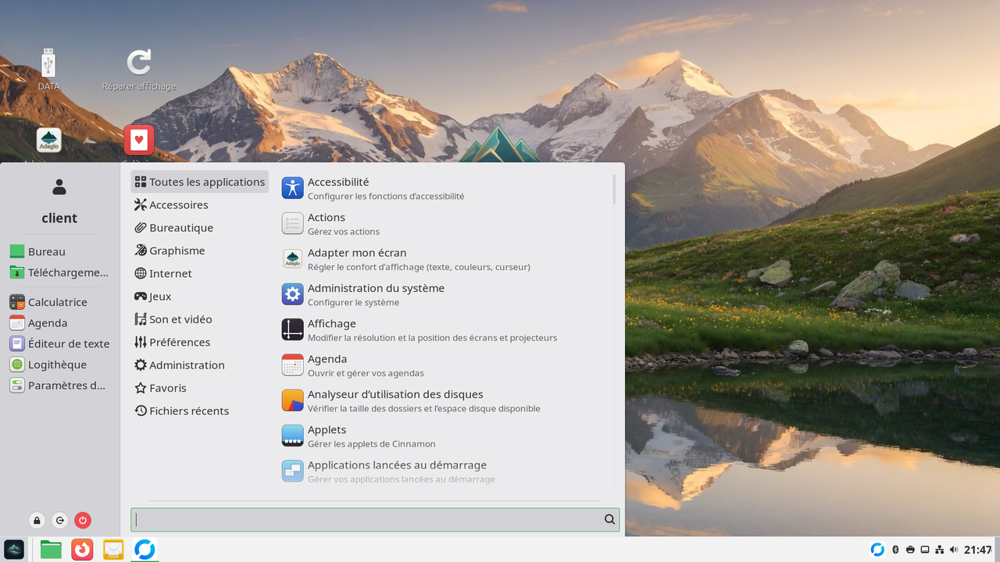
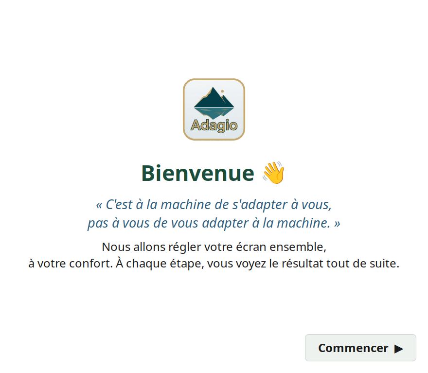

# NOLAM Adagio

**Français** · [English](README.en.md)

> *Lentement, et avec aise.*


**Et si l'ordinateur leur ressemblait enfin ?**

NOLAM Adagio adapte l'interface de **Linux Mint Cinnamon** à la personne qui s'en sert — sa vue, ses gestes, ses habitudes — au lieu de lui demander de s'adapter à la machine. Un seul script, des profils prêts à l'emploi, et **tout est réversible**.

Pensé pour les **seniors** et les personnes en situation de **handicap visuel**, à installer par un proche ou un informaticien.



---

## Pourquoi

Les réglages d'accessibilité existent déjà dans Linux — mais ils sont éparpillés dans dix menus, et personne n'ose y toucher de peur de tout casser. Adagio les rassemble en **expériences cohérentes**, applicables en une commande, annulables en une autre.

Pas une distribution à maintenir. Pas une usine à gaz. Une **couche douce** par-dessus un système stable que vous gardez à jour normalement.

## Profils

| Profil | Pour qui | Ce qu'il fait |
|--------|----------|---------------|
| `senior` | Vue qui baisse, peur de mal cliquer | Texte plus grand, curseur visible, **un seul clic** pour ouvrir, titres lisibles |
| `malvoyant` | Basse vision | Texte très agrandi, **fort contraste**, curseur énorme, **loupe d'écran** activée |

*À venir : `motricite` (cibles larges, anti-tremblement), `cognitif` (interface épurée et verrouillée), `non-voyant` (lecteur d'écran Orca — en V2, avec un testeur réellement concerné).*

## L'assistant « Adapter mon écran »

Pas besoin de connaître les profils : Adagio inclut un **assistant graphique** qui règle l'affichage en posant des questions simples — *« lisez-vous bien ce texte ? »*, `A−` / `A+`, vignettes Clair / Sombre / Contraste — avec un **aperçu en direct**. Il est conçu pour être utilisable **avant** tout réglage : il démarre déjà grand et contrasté.



Deux dimensions :

1. **Confort visuel** — trois portes (« je vois mal », « gestes difficiles », « je débute ») mènent à un profil, puis on affine en direct.
2. **Niveau d'autonomie** — *Tranquille* / *Curieux* / *Aux commandes* : décide de ce qu'on montre ou masque (outils techniques, logithèque), parce que respecter l'autonomie fait aussi partie de l'accessibilité.

Tout ce que l'assistant règle est écrit dans un **profil réutilisable et exportable** (même format que `profiles/*.conf`). Relançable à tout moment via le lanceur **« Adapter mon écran »**. Interface **bilingue FR / DE**.

## Utilisation

```bash
git clone https://github.com/dpanbug/nolam-adagio.git
cd nolam-adagio

./install.sh --list          # voir les profils
./install.sh senior          # appliquer un profil
./restore.sh                 # tout remettre comme avant
```

Aucun `sudo` : Adagio ne modifie que les réglages de votre session (via `dconf`/`gsettings`), jamais le système.

## Comment ça marche

Chaque profil est un simple fichier `profiles/*.conf` au format lisible :

```ini
[org.cinnamon.desktop.interface]
text-scaling-factor = 1.4    # texte 40 % plus grand
cursor-size = 36             # curseur bien visible
```

Le moteur lit ces clés et les applique avec `gsettings`. **Ajouter une déclinaison = écrire un fichier**, pas du code. Les contributions sont les bienvenues.

Avant d'appliquer quoi que ce soit, `install.sh` sauvegarde l'état complet de votre bureau (`dconf dump`). `restore.sh` le recharge à l'identique. C'est le filet de sécurité qui permet d'essayer sans crainte.

## Notes

- Le profil `malvoyant` utilise le thème **HighContrast** ; s'il n'est pas installé (`sudo apt install gnome-themes-extra`), Adagio ignore proprement la ligne et applique le reste.
- Testé sur Linux Mint 21+ (Cinnamon). Les réglages absents d'une version sont ignorés sans erreur.

## Licence

**GPL-3.0** (voir [LICENSE](LICENSE)). Logiciel libre : vous pouvez l'utiliser, l'étudier, le modifier et le partager. Toute version dérivée doit rester libre sous la même licence — l'ouverture se propage, personne ne peut enfermer ce projet.

---

*Un projet [NOLAM](https://nolam.ch) — des outils numériques qui rendent l'autonomie, pas qui la confisquent.*
*Présentation : [nolam.ch/adagio](https://nolam.ch/adagio/) · Contribuer : [CONTRIBUTING.md](CONTRIBUTING.md)*
